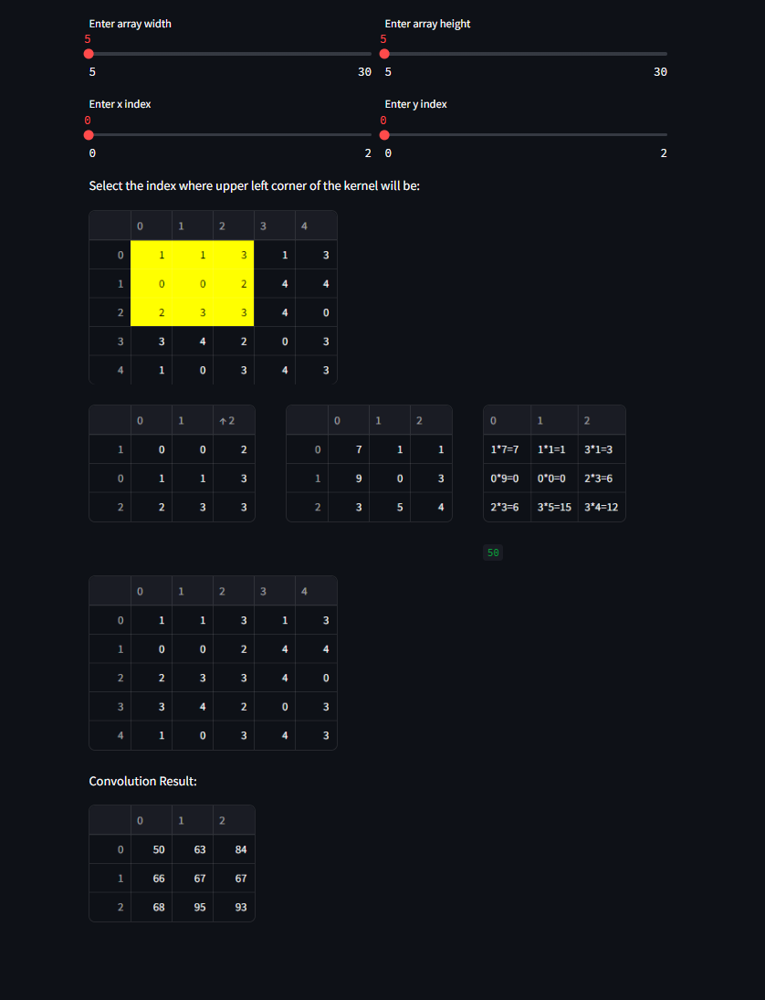

# Streamlit Kernel Computation Demo

Original author: Jan Korytář

This Streamlit demo showcases kernel computation using sliders for customization and visualization.

### Libraries
The following libraries are imported:
- `streamlit` as `st`
- `pandas` as `pd`
- `numpy` as `np`
- `correlate2d` from `scipy.signal`

### Sidebar Customization
- **Kernel Customization**: Users can adjust kernel dimensions using a slider in the sidebar.
  - If the kernel is not initialized or dimensions change, a random kernel with specified dimensions is created.
  - The kernel is displayed in a data editor for user interaction.

### Main Interface
- **Title**: "Simple kernel computation demo"
- **Kernel Settings Sidebar**: Users can set array width, height, and indices using sliders.
- **Instructions**: Users are prompted to select the upper-left corner of the kernel.

### Visual Representation
- The DataFrame displays array data with highlighted user-selected area.
- **DataFrame Display**:
  - Columns and rows are highlighted based on user-selected indices.
- **Output Display**:
  - Three columns are displayed:
    1. **Chosen Area**: User-selected array area
    2. **Kernel Data**: Kernel displayed in the data editor
    3. **Combined Operation**: Multiplication of chosen area and kernel, showing results
  
### Convolution Result
- **Convolution**: Utilizes `correlate2d` from `scipy.signal` to compute convolution result.
- Convolution result is displayed in a DataFrame.
